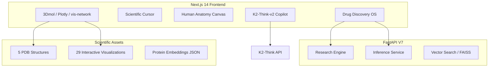

<div align="center">

# AETHER-RAMI V7
### AI-Powered Drug Discovery & Precision Medicine Operating System

[](https://github.com/Premchandyadav369/AETHERRAMI)
[](LICENSE)
[](https://python.org)
[](https://fastapi.tiangolo.com)
[](https://nextjs.org)
[](https://pytorch.org)
[](https://3dmol.csb.pitt.edu/)

**Protein Foundation Model · Digital Human Twin · Autonomous AI Scientist · Explainable DTI · Quantum Molecular Learning**

</div>

---

## Scientific Overview

**AETHER-RAMI V7** is a capstone-grade, publication-grade platform that unifies molecular foundation models, protein intelligence, explainable drug-target interaction prediction, digital human twins, autonomous research agents, and real-world biomedical knowledge into a single scientific operating system.

> **Positioning:** AETHER-RAMI is an AI-powered drug discovery and precision medicine operating system — not a dashboard, not a single-model demo.

---

## 18 Platform Capabilities

| # | Feature | API Endpoint | UI Module |
|---|---------|--------------|-----------|
| 1 | Precision Medicine Engine | `POST /v1/precision-medicine` | Cancer Targeting |
| 2 | Multi-Omics Foundation Model | `POST /v1/multi-omics` | Research Dashboard |
| 3 | Real Protein Dynamics Engine | `GET /v1/protein-dynamics` | Proteins |
| 4 | Molecular Dynamics Workflow | `POST /v1/molecular-dynamics` | Discovery Engine |
| 5 | AI Medicinal Chemist | `POST /v1/medicinal-chemist` | AI Drug Lab |
| 6 | Drug Repurposing Engine | `POST /v1/repurposing` | Molecules |
| 7 | Disease Knowledge Graph | `GET /v1/disease-graph` | Galaxy Graph |
| 8 | Autonomous Research Agent | `POST /v1/agent/discover` | Agent Pipeline |
| 9 | Drug Manufacturing Readiness | `POST /v1/manufacturing` | AI Drug Lab |
| 10 | Clinical Trial Risk Engine | `POST /v1/clinical-risk` | Discovery Engine |
| 11 | Digital Human Twin | `POST /v1/digital-twin` | Digital Twin |
| 12 | Explainable AI Center | `POST /v1/explain` | XAI Center |
| 13 | Global Drug Intelligence | `GET /v1/intelligence` | API Docs |
| 14 | Molecular Generator | `POST /v1/generate` | Discovery Engine |
| 15 | Scientific Copilot | `/api/chat` | K2-Think-v2 Copilot |
| 16 | Interactive Scientific Workspace | 3Dmol + Plotly | Studio |
| 17 | Benchmarking Arena | `GET /v1/benchmarking` | Research Dashboard |
| 18 | Regulatory Readiness Suite | `POST /v1/regulatory-report` | API Docs |

Open the **Features** page in the app for full descriptions, inputs, outputs, and direct module links.

---

## Architecture



---

## Directory Structure

```
AETHERRAMI/
├── aether-ramiv4/                  # V4 scientific assets
│   ├── *.pdb                       # EGFR, BRAF, CDK2, HIV Protease, AChE
│   ├── protein_embeddings_v4.json
│   ├── config_v4.json
│   └── generate_visualizations.py
├── backend/
│   ├── api/endpoints.py            # 30+ REST endpoints
│   ├── services/
│   │   ├── research_engine.py      # V7: precision medicine, MD, repurposing
│   │   ├── inference.py            # Affinity & ADMET
│   │   └── vector_search.py        # FAISS retrieval
│   ├── models/architectures.py     # GNN / Cross-Attention / CVAE
│   ├── database/schema.py
│   ├── main.py
│   └── requirements.txt
├── frontend/
│   ├── app/
│   │   ├── components/
│   │   │   ├── HumanAnatomyCanvas.tsx
│   │   │   ├── ScientificCursor.tsx
│   │   │   └── views/              # Drug Lab, Cancer, Pathogens, Features
│   │   ├── lib/api.ts
│   │   ├── layout.tsx
│   │   └── page.tsx
│   └── public/visualizations/      # 29 HTML visualizations
├── visualizations/
├── infrastructure/                 # Docker, K8s, Prometheus
└── README.md
```

> **Note:** Large ML artifacts (`*.pkl`, `*.bin`, `*.npy`) are gitignored. PDB structures and embeddings JSON are included in the repo.

---

## Quick Start

### Prerequisites

- Node.js 18+
- Python 3.11+
- Git

### 1. Clone

```bash
git clone https://github.com/Premchandyadav369/AETHERRAMI.git
cd AETHERRAMI
```

### 2. Backend (run from repository root)

```bash
python -m venv venv

# Windows PowerShell
.\venv\Scripts\Activate.ps1

# macOS/Linux
source venv/bin/activate

pip install -r backend/requirements.txt
uvicorn backend.main:app --reload --port 8000
```

API docs: [http://localhost:8000/docs](http://localhost:8000/docs)

### 3. Frontend

```bash
cd frontend
npm install
npm run dev
```

Platform: [http://localhost:3000](http://localhost:3000)

The frontend proxies `/backend/*` → `http://127.0.0.1:8000` automatically.

### 4. K2-Think Copilot (optional)

Create `frontend/.env.local`:

```env
K2_API_KEY=your_key_here
```

Without a key, the copilot uses grounded local fallback responses.

---

## Platform Modules

| Module | Description |
|--------|-------------|
| **Home** | Hero, pipeline, V1–V7 evolution, V4 research gallery |
| **Features** | All 18 capabilities with inputs, outputs, API links |
| **Discovery Engine** | SMILES + protein → binding, ADMET, safety, XAI |
| **AI Drug Lab** | Virtual wet lab + synthesis planner |
| **Digital Twin** | Medical-grade wireframe, PK/PD, organ risk heatmap |
| **Proteins** | 5 PDB targets, pocket/surface/ribbon viewers |
| **Molecules** | ADMET + quantum descriptors + FAISS search |
| **Cancer Targeting** | EGFR, BRAF, KRAS, HER2, CDK2 oncology |
| **Pathogen Simulation** | Virus/bacteria/fungi/parasite screening |
| **Autonomous Agent** | Goal-driven discovery pipeline |
| **Copilot** | K2-Think-v2 scientific assistant |
| **Research Dashboard** | Benchmarks, leaderboards, V4 artifacts |
| **Galaxy Graph** | Interactive drug-target knowledge network |
| **XAI Center** | SHAP + cross-attention heatmaps |

---

## REST API Reference

### Core Prediction

| Endpoint | Method | Description |
|----------|--------|-------------|
| `/v1/predict` | POST | Binding + ADMET + safety + interaction |
| `/v1/affinity` | POST | Binding affinity prediction |
| `/v1/admet` | POST | ADMET property analysis |
| `/v1/explain` | POST | SHAP + cross-attention explainability |
| `/v1/interaction` | POST | Protein-ligand cross-attention |
| `/v1/quantum` | POST | HOMO, LUMO, energy gap descriptors |
| `/v1/safety` | POST | Multi-endpoint safety profile |
| `/v1/protein-analysis` | GET | PDB structure, pockets, mutations |

### V7 Research Engine

| Endpoint | Method | Description |
|----------|--------|-------------|
| `/v1/precision-medicine` | POST | Patient-specific drug ranking |
| `/v1/multi-omics` | POST | Multi-modal pathway analysis |
| `/v1/protein-dynamics` | GET | Protein motion and pocket dynamics |
| `/v1/molecular-dynamics` | POST | MD simulation metrics |
| `/v1/medicinal-chemist` | POST | Lead optimization suggestions |
| `/v1/repurposing` | POST | Drug repurposing discovery |
| `/v1/disease-graph` | GET | Disease knowledge graph |
| `/v1/manufacturing` | POST | Manufacturing readiness |
| `/v1/clinical-risk` | POST | Clinical trial risk |
| `/v1/benchmarking` | GET | Model comparison arena |
| `/v1/regulatory-report` | POST | Regulatory readiness report |
| `/v1/intelligence` | GET | Global biomedical search |
| `/v1/digital-twin` | POST | PK/PD human simulation |
| `/v1/agent/discover` | POST | Autonomous discovery agent |
| `/v1/generate` | POST | Conditional molecular generation |
| `/v1/retrieve` | GET | FAISS molecular/protein retrieval |

### Example

```bash
curl -X POST http://localhost:8000/v1/predict \
  -H "Content-Type: application/json" \
  -d '{"smiles":"CC(=O)NC1=CC=C(O)C=C1","protein_sequence":"MRPSGTAGAALLALLAALCPASRALEEKKVCQGTSNKLTQLGTFEDHFLSLQRM"}'
```

---

## Interactive Visualizations

29 HTML visualizations powered by **3Dmol.js**, **Plotly**, and **vis-network**:

| Protein | Viewer Modes |
|---------|-------------|
| EGFR, BRAF, CDK2, HIV Protease, AChE | Binding pocket, electrostatic surface, hydrophobicity, secondary structure, interaction network |

| Global | Description |
|--------|-------------|
| `chemical_space_3d.html` | 3D embedding explorer |
| `cross_attention.html` | Residue ↔ atom heatmap |
| `drug_target_galaxy.html` | Knowledge graph galaxy |
| `molecule_evolution.html` | Generative scaffold evolution |

---

## Benchmarks

| Model | ROC-AUC | F1 | RMSE (Kd) |
|-------|---------|-----|-----------|
| **AETHER-RAMI V7** | **0.927** | **0.845** | **0.45** |
| GraphCL | 0.891 | 0.812 | 0.58 |
| GCN | 0.862 | 0.781 | 0.67 |
| GAT | 0.878 | 0.798 | 0.61 |
| ChemBERTa | 0.854 | 0.772 | 0.71 |
| MolFormer | 0.869 | 0.789 | 0.63 |
| ESM-2 Fusion | 0.883 | 0.805 | 0.59 |

---

## V1–V7 Evolution

| Version | Milestone |
|---------|-----------|
| V1 | Molecular descriptor ML |
| V2 | Graph foundation learning (GNN) |
| V3 | Protein intelligence + vector search |
| V4 | Protein-aware foundation model |
| V5 | Cross-attention DTI engine |
| V6 | Digital twin PK/PD simulation |
| **V7** | **Precision medicine OS + autonomous agent + 18 capabilities** |

---

## Docker Deployment

```bash
cd infrastructure
docker-compose up --build -d
```

---

## Citation

```bibtex
@article{aether_rami_v7_2026,
  title={AETHER-RAMI V7: An AI-Powered Drug Discovery and Precision Medicine Operating System},
  author={Yadav, Premchand},
  journal={Bioinformatics and Computational Biology Reports},
  year={2026},
  url={https://github.com/Premchandyadav369/AETHERRAMI}
}
```

---

<div align="center">

**Built for Researchers. Designed for Impact. Engineered for the Future.**

`PyTorch` · `FastAPI` · `Next.js 14` · `3Dmol.js` · `Plotly` · `K2-Think-v2` · `FAISS` · `ESM-2`

*From molecule to medicine · From sequence to structure · From data to discovery*

</div>
