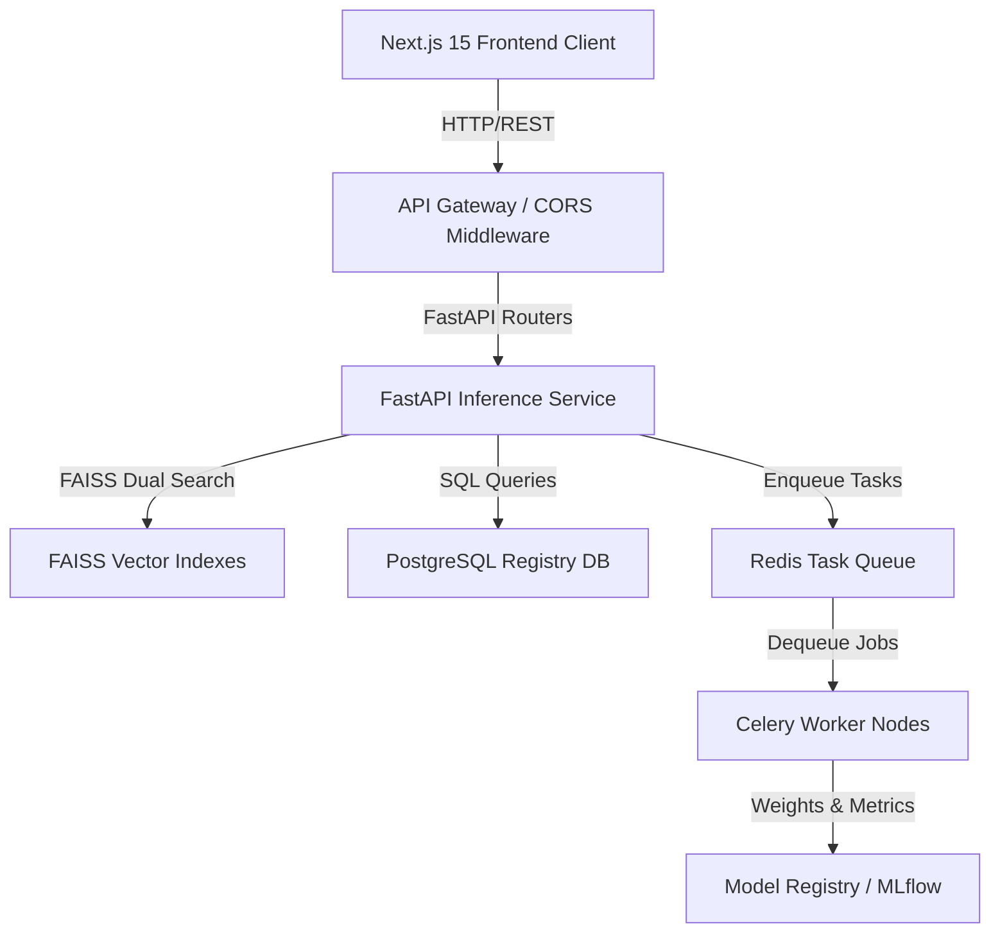

# AETHER-RAMI V6: System Architecture & API Specifications

## 1. System Architecture Diagram



---

## 2. Database Schema Reference

The database models are implemented using SQLAlchemy. The major tables are:

### `model_registry`
Stores checkpoint mappings, performance metrics, and production status.
- `id` (INT, PK): Unique identifier.
- `version` (VARCHAR, Unique): e.g., `AETHER-RAMI V6.0.0`.
- `status` (VARCHAR): `production`, `candidate`, `archived`.
- `auc_score` (FLOAT): Area under ROC curve.
- `f1_score` (FLOAT): F1 metric.
- `mcc_score` (FLOAT): Matthews correlation coefficient.
- `hyperparameters` (JSON): Model parameter mapping.
- `storage_uri` (VARCHAR): Path to the saved weights.

### `dataset_registry`
Tracks pre-training and fine-tuning datasets.
- `id` (INT, PK).
- `name` (VARCHAR): e.g., `BACE`, `BBBP`.
- `task_type` (VARCHAR): Classification or regression.
- `num_samples` (INT): Total count of molecules.
- `split_method` (VARCHAR): Scaffold splitting method.

### `active_learning_feedback`
Stores verified expert affinity ratings for active learning loops.
- `id` (INT, PK).
- `smiles` (TEXT): Chemical molecular string.
- `predicted_affinity` (FLOAT): AI model prediction value.
- `expert_verified_affinity` (FLOAT): True values validated in lab.
- `expert_label_corrected` (BOOLEAN): Status of label updates.

---

## 3. Core API Specifications

All endpoints are prefixed with `/v1`.

### `POST /predict`
Run simultaneous affinity predictions and ADMET profile extraction.
- **Request Body**:
  ```json
  {
    "smiles": "CC(=O)NC1=CC=C(O)C=C1",
    "protein_sequence": "MSLSDKDKAAVKALAELIPQLEK..."
  }
  ```
- **Response**:
  ```json
  {
    "smiles": "CC(=O)NC1=CC=C(O)C=C1",
    "binding_affinity": {
      "affinity_pKd": 8.76,
      "status": "Strong Binder"
    },
    "admet_properties": {
      "qed": 0.84,
      "lipinski": { "violations": 0, "passed": true },
      "bbb_penetration": { "probability": 0.82, "class": "BBB+" }
    }
  }
  ```

### `GET /retrieve`
RAMI retrieval query for molecules or protein targets.
- **Query Parameter**: `query` (SMILES or sequence string).
- **Response**:
  ```json
  {
    "query_type": "molecule",
    "results": [
      { "smiles": "CC(=O)...", "similarity": 0.94, "qed": 0.88 }
    ]
  }
  ```

### `POST /train`
Trigger background incremental retraining using the active learning logs.
- **Response**:
  ```json
  {
    "status": "training_triggered",
    "message": "Model retraining pipeline initiated in background."
  }
  ```

---

## 4. MLOps & Security Architecture

1. **Active Learning Feedback Loop**:
   - Out-of-distribution molecules or predictions with high BALD uncertainty scores are logged to `active_learning_feedback`.
   - Experts review these compounds and input verified laboratory values.
   - Once verified records cross the trigger batch size (e.g. 500 records), an asynchronous Celery task compiles a training dataset and retrains the head weights.
   - The newly trained model candidate is benchmarked against test sets, and if validation metrics exceed the production threshold (e.g. AUC > previous version), it is automatically promoted.

2. **Security**:
   - **Authentication**: JWT-based OAuth2 secure authentication for all write APIs (`/train`, `/feedback`).
   - **Access Control**: Role-based access control (RBAC) separating base researchers from administrator roles.
   - **Ingress Safeguards**: Rate-limiting implemented via Redis to prevent DDoS vectors on resource-heavy GNN/Transformer inference pipelines.
